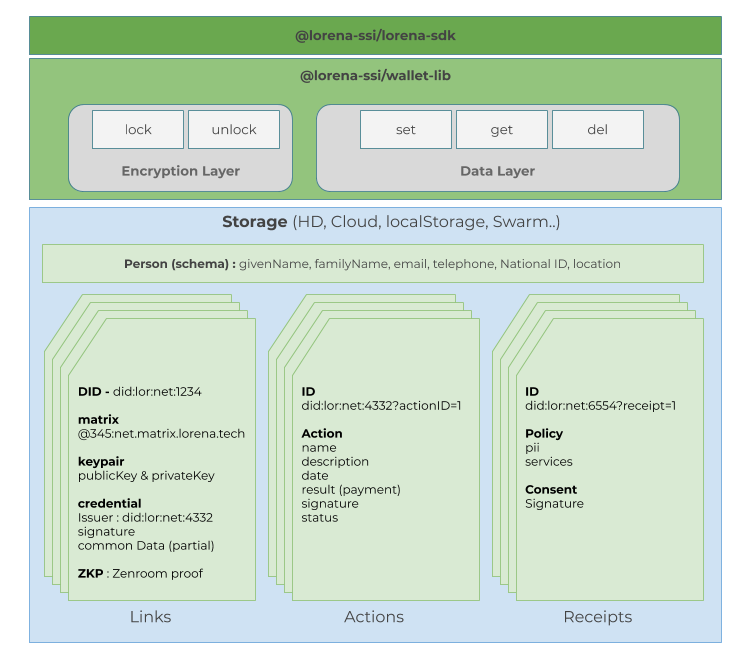

# Lorena Wallet Library

[](https://travis-ci.com/lorena-ssi/wallet-lib)
[](https://coveralls.io/github/lorena-ssi/wallet-lib?branch=master&service=github)

The Lorena Wallet Library provides a method for storage, encryption, and retrieval of sensitive information such as private keys and verifiable credentials.  This library is useful in back-end Javascript server applications (such as NodeJS) or in front-end Javascript (such as Vue, React, or React Native).

The library provides interfaces appropriate for interaction with the [Lorena SDK](https://github.com/lorena-ssi/lorena-sdk), and it is used in the [Lorena Terminal](https://github.com/lorena-ssi/terminal).

## Overview



## Storage methods

The library includes implementation of in-memory and filesystem storage methods (useful for console applications, server back-ends, or tests).  For use in a web application the storage can be implemented in a derived class to take advantage of browser local storage; for mobile applications the mobile SDK should be used.

### Filesystem

The default implementation works with a POSIX filesystem, storing the data in the user's home directory under the subdirectory `.lorena/wallets` with the filename being the wallet username (e.g. `~/.lorena/wallets/myUserName`).  The file is encrypted with the password.

## Encryption

Encryption uses [Zenroom](https://zenroom.org/), a cryptographic virtual machine that provides cross-platform, safe and reliable encryption.

## Usage

```
npm install @lorena-ssi/wallet-lib
```

``` js
const Wallet = require('@lorena-ssi/wallet-lib').default

const options = {
  storage: 'fs', // default in the filesystem; 'mem' for in-memory
  silent: true // default silences Zenroom debugging messages
}

// create your instance of the wallet with the username supplied
const myWallet = new Wallet('myUserName', options)

// attempt to unlock an existing wallet (since it is in-memory, this will be `false`)
let result = myWallet.unlock('myPassword')

// this is a new wallet, so `unlock` returned `false`.
assert(result === false)

myWallet.info.myData = 'this is my sensitive data'

// write changes to disk (encrypted: you need to supply the password)
result = myWallet.lock('myPassword')

// successful (password correct, data saved)
assert(result === true)

// data is stored on the filesystem, encrypted with the password

//////////////////////////
//  start a new session

// create your instance of the wallet with the username supplied
const myWallet2 = new Wallet('myUserName', options)

// try to unlock with the wrong password
result = myWallet2.unlock('someOtherPassword')

// will not work
assert(result === false)

// Read encrypted data
result = myWallet2.unlock('myPassword')

// successful (password correct)
assert(result === true)

// Data that you saved in the previous session is now loaded.
assert(myWallet2.info.myData === 'this is my sensitive data')

// add more data
myWallet2.info.moreData = 'additional secrets'

// write changes to disk (encrypted: you need to supply the password)
result = myWallet2.lock('myPassword')

// successful (password correct, data saved)
assert(result === true)
```

## License

MIT
